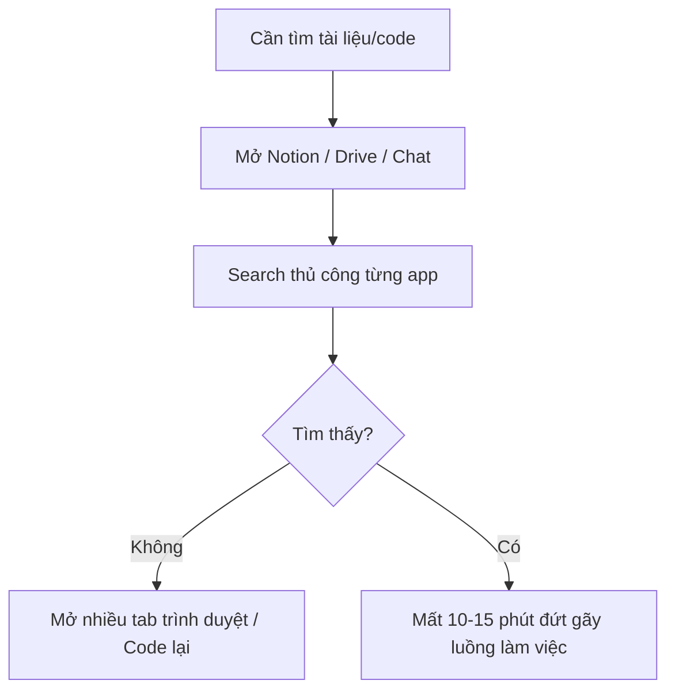
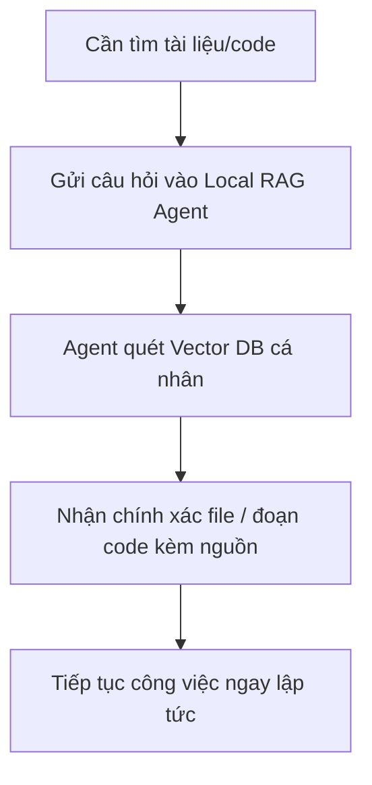
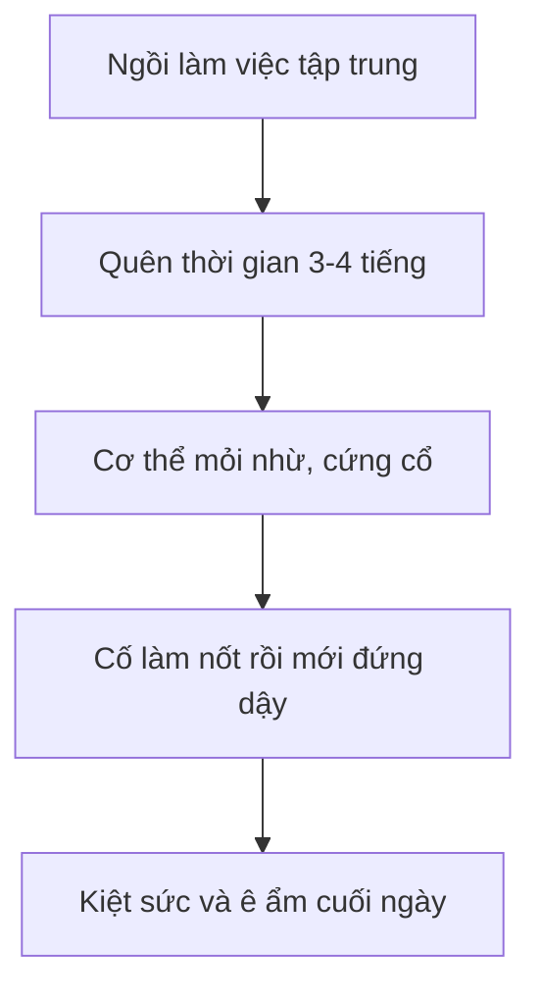
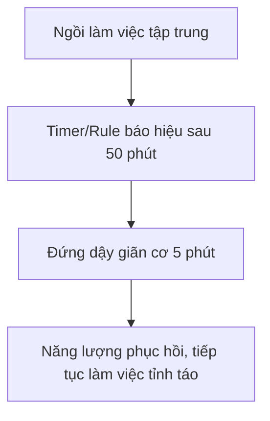
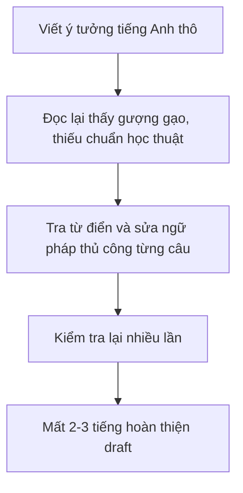
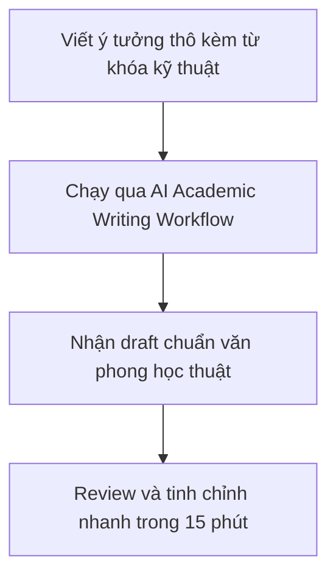

# Phase 1: Individual Scan
| # | Lăng kính | Problem quan sát được | Ai chịu ảnh hưởng? | Dấu hiệu thật |
|---|---|---|---|---|
| 1 | Quản lý thời gian | Xung đột quỹ thời gian giữa công việc chuyên môn ban ngày và thời gian tự học, nghiên cứu ban đêm | Bản thân | Thường xuyên phải thức khuya kéo dài, làm lệch nhịp sinh học và giảm năng suất ngày hôm sau |
| 2 | Sức khỏe thể chất | Ngồi làm việc và học tập liên tục trước máy tính trong thời gian dài ít vận động | Bản thân | Mỏi vai gáy, cứng cổ, mỏi mắt và giảm thể lực vào cuối ngày |
| 3 | Mất tập trung | Chuyển đổi tư duy (Context-switching) giữa phát triển Backend (C#/.NET, SQL) và nghiên cứu Toán cao cấp / Lý thuyết AI | Dev / CS Researcher | Mất 20–30 phút để "mồi" lại tư duy mỗi khi đổi từ code logic hệ thống sang giải thuật toán |
| 4 | Tốn thời gian | Trau chuốt báo cáo tiến độ nghiên cứu và viết draft bài báo bằng tiếng Anh chuyên ngành | Academic Researcher / Dev | Mất 2–3 tiếng điều chỉnh văn phong, câu từ chuẩn mực trước khi gửi cho Advisor/Prof |
| 5 | Tốn thời gian | Soạn thảo quy trình Troubleshooting và giải trình sự cố kỹ thuật bằng tiếng Anh chuyên môn | Tech Support / Engineer | Tốn 20–30 phút cho mỗi ticket/email để diễn đạt nguyên nhân kỹ thuật một cách dễ hiểu |
| 6 | Tổ chức cá nhân | Tài nguyên học tập, tài liệu nghiên cứu và ghi chú cá nhân bị phân mảnh trên nhiều ứng dụng | Bản thân | Mất 10–15 phút lục lọi lại các tài liệu hoặc đoạn code mẫu từng lưu trữ từ lâu |

# Phase 2: Problem Card

 
### Problem 1: Quản lý tài nguyên học tập và tài liệu nghiên cứu phân mảnh
 
- **Problem (1 câu):** Tài nguyên học tập, mã nguồn mẫu và tài liệu nghiên cứu bị phân tán rải rác trên nhiều ứng dụng khác nhau khiến việc tra cứu tốn nhiều thời gian.
- **Actor:** Bản thân (Developer & Researcher).
- **Current workflow (3–7 bước):**
  1. Nhớ lại lờ mờ về một đoạn code mẫu hoặc tài liệu từng xem qua.
  2. Mở lần lượt các nền tảng (Notion, Google Drive, chat history, local folders).
  3. Dùng thanh tìm kiếm riêng của từng ứng dụng nhưng không tìm ra từ khóa chính xác.
  4. Mở nhiều tab trình duyệt, đọc lướt qua các file tiềm năng.
  5. Tìm thấy file hoặc phải viết lại code/tìm lại từ đầu.
- **Bottleneck:** Thiếu một trung tâm định tuyến dữ liệu tập trung và cấu trúc gắn thẻ (tagging) không đồng bộ giữa các nền tảng.
- **Impact:** Mất 10–15 phút cho mỗi lần tìm kiếm, làm đứt gãy luồng tư duy tập trung sâu (deep work).
- **Success metric:** Thời gian tìm kiếm tài liệu hoặc đoạn code mẫu giảm xuống dưới 1 phút.
- **Non-AI alternative:** Xây dựng quy chuẩn đặt tên file nghiêm ngặt, quy hoạch toàn bộ về một kho lưu trữ duy nhất và lập bảng Index thủ công.
- **AI hypothesis:** Xây dựng một local RAG agent tự động index toàn bộ tài liệu, code snippet cá nhân và cho phép chat tra cứu ngữ nghĩa tức thì qua vector DB.
- **Quick gut:** Agent.
#### Draft Workflow Trước / Sau
 
**Trước (Hiện tại):**
 

 
**Sau (Đề xuất):**
 

 
---
 
### Problem 2: Sức khỏe thể chất do ngồi máy tính liên tục ít vận động
 
- **Problem (1 câu):** Ngồi làm việc và học tập liên tục trước máy tính trong thời gian dài mà thiếu nhắc nhở vận động gây mỏi vai gáy, cứng cổ và giảm thể lực.
- **Actor:** Bản thân.
- **Current workflow (3–7 bước):**
  1. Ngồi vào bàn làm việc, chìm đắm vào code hoặc giải thuật toán.
  2. Quên mất thời gian trôi qua, giữ nguyên một tư thế trong 3–4 tiếng liên tục.
  3. Bắt đầu cảm thấy mỏi cổ, cứng vai hoặc mỏi mắt rõ rệt.
  4. Cố gắng hoàn thành nốt công việc dở dang trước khi đứng dậy.
  5. Kết thúc ngày làm việc với cơ thể ê ẩm và uể oải.
- **Bottleneck:** Thiếu cơ chế ngắt nhịp (interrupt mechanism) chủ động và khách quan khi đang ở trạng thái tập trung cao độ (hyper-focus).
- **Impact:** Đau mỏi vai gáy, giảm thể lực, ảnh hưởng tiêu cực đến năng lượng cho khung giờ tối.
- **Success metric:** Có ít nhất 3 lần đứng lên vận động/giãn cơ mỗi phiên làm việc dài; giảm rõ rệt cảm giác đau mỏi vào cuối ngày.
- **Non-AI alternative:** Cài đặt ứng dụng nhắc nhở bấm giờ (Pomodoro/Stretchly) trên máy tính để phát chuông sau mỗi 45–60 phút.
- **AI hypothesis:** Hệ thống Rule/Workflow kết hợp phân tích pattern hoạt động bàn phím để tự động phát hiện thời điểm ngồi quá lâu và kích hoạt thông báo kèm bài tập giãn cơ phù hợp ngữ cảnh.
- **Quick gut:** Rule / Workflow.
#### Draft Workflow Trước / Sau
 
**Trước (Hiện tại):**
 

 
**Sau (Đề xuất):**
 

 
---
 
### Problem 3: Tốn thời gian trau chuốt báo cáo nghiên cứu và viết draft tiếng Anh chuyên ngành
 
- **Problem (1 câu):** Mất nhiều thời gian để trau chuốt văn phong, ngữ pháp và thuật ngữ chuẩn bằng tiếng Anh khi viết báo cáo nghiên cứu hoặc email trao đổi với giảng viên.
- **Actor:** Academic Researcher / Dev.
- **Current workflow (3–7 bước):**
  1. Viết nháp ý tưởng bằng tiếng Anh thô hoặc dịch trực tiếp từ tiếng Việt sang.
  2. Đọc lại từng câu và nhận ra văn phong chưa đạt chuẩn học thuật (academic tone).
  3. Tra từ điển hoặc công cụ dịch thủ công từng đoạn nhỏ.
  4. Sửa đi sửa lại các cấu trúc câu phức tạp liên quan đến thuật toán hoặc chuyên môn.
  5. Hoàn thiện và gửi bản thảo với cảm giác lo lắng về câu chữ.
- **Bottleneck:** Thiếu sự hỗ trợ chuyển đổi văn phong học thuật tự động từ ý tưởng thô, dẫn đến việc lãng phí thời gian cho khâu biên tập cú pháp thay vì nội dung lõi.
- **Impact:** Tốn 2–3 tiếng cho mỗi bản thảo/báo cáo, làm chậm tiến độ gửi thông tin cho advisor hoặc nộp bài.
- **Success metric:** Thời gian hoàn thiện draft tiếng Anh đạt chuẩn học thuật giảm từ 2–3 giờ xuống dưới 30 phút.
- **Non-AI alternative:** Sử dụng từ điển đồng nghĩa (Thesaurus), các mẫu câu học thuật có sẵn (Academic Phrasebank) và Grammarly phiên bản cơ bản.
- **AI hypothesis:** Sử dụng AI Workflow / Prompt Template chuyên biệt cho Academic Writing để nhận draft thô, tự động chuẩn hóa văn phong học thuật và tối ưu thuật ngữ chuyên ngành.
- **Quick gut:** Workflow.
#### Draft Workflow Trước / Sau
 
**Trước (Hiện tại):**
 

 
**Sau (Đề xuất):**
 
